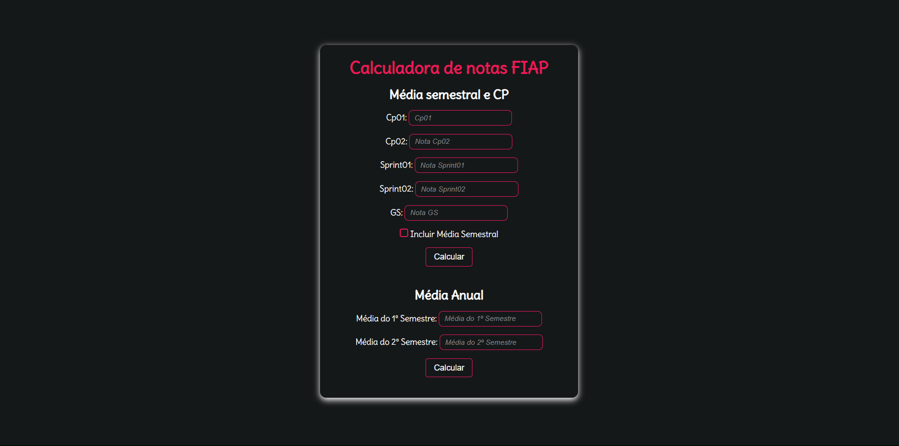

---

## **💻 Sobre**

Calculadora desenvolvida para uso dos alunos da Fiap.

Alguns features existentes são:

- .
- .

Você pode acessá-lo com este [link.](https://d-araujof.github.io/Notas_Fiap/)

---

## **🚀 Tecnologias**

Esse projeto foi desenvolvido com as seguintes ferramentas:

- HTML5
- CSS3
- JavaScript
- Figma

---

## **📝 Licença**

Esse projeto está sob a licença MIT.

---

Desenvolvido com ❤️ por Maria Eduarda
